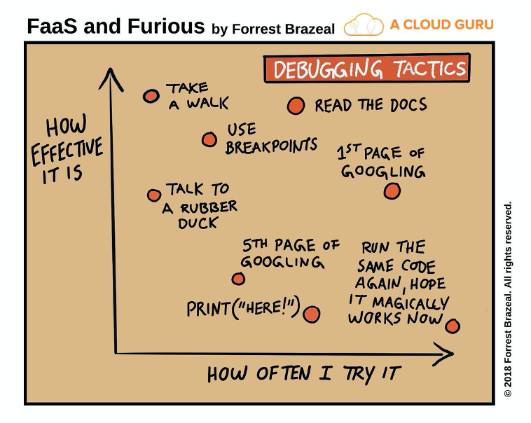

# []()

# Key information to get you started...

::: {.notes}
This presentation contains key contact and delivery information about the module.
:::

+:------------------------+:--------------------------+
| **Module Lead**         |  **Contact**              |
+=========================+===========================+
| Jon Reades              |  Email,                   |
|                         |  Slack                    |
+-------------------------+---------------------------+
| **Lecturers**           |                           |
+-------------------------+---------------------------+
|  TBC,                   |  Slack                    |
|  TBC                    |                           |
+-------------------------+---------------------------+
| **PGTAs**               |                           |
+-------------------------+---------------------------+
|  TBC,                   |  Slack                    |
|  Adam Zhou,             |                           |
|  Maria Wood             |                           |
+-------------------------+---------------------------+

## Where I'm Standing

::: {style="font-size:34pt;margin-top:44pt;"}

BA **Comparative Literature** → software developer, dot.com New York → PhD **Urban Planning** → post-doc in **network science** → Lecturer in **Quantitative Human Geography** → Professor of **Geographic Data Science**

:::

. . .

::: {style="font-size:34pt;margin-top:44pt;"}

No computer science here!

:::

::: {.notes}

Let me make this clear: **I have no formal training in computer science.** I took  night classes after graduation. I have spent twenty-five years around people who *did* train in it. But I have never taken a degree in it, and I am now a professor of geographic data science.

This is not a story about me being clever, it's a description of the field. At CASA I work with economists, regional scientists, artists, literature graduates, planners, political scientists — and yes, computer scientists. Urban analytics is not staffed by specialists. It is staffed by people who found a problem that they cared about and were willing to keep learning.

So if you are sitting there this week with a biology degree or a planning degree or an architecture degree, wondering whether you are in the wrong room: you are not. That is the normal way in. It is, in fact, close to the *only* way in, because the interesting problems do not respect the departmental boundaries.

The other thing worth saying: I am an intellectual magpie. I get distracted by shiny things. That has been my whole academic strategy, such as it is. Bizarrely, sometimes it pays off!

:::

## Useful Information

*Foundations* is distributed across *two* web sites:

1. The micro-site: []() -- lectures, practicals, readings, and information about the assessments. This will remain accessible to you after graduation.
2. Moodle: []() -- recorded sessions, booking drop-in hours, group messaging, 'answer sheets', and submission of assessments, as well as other formal  components. This is tied to your enrolment at UCL.

And don't forget about this quick introduction to Python: [jreades.github.io/code-camp/](https://jreades.github.io/code-camp/)!

## Where Does FSDS Fit? {.smaller}

:::: {.columns}

::: {.column width="50%"}
**Geographic Information Systems (GIS)**

- Foundations of spatial analysis
- Working with geo-data

**Quantitative Methods (QM)**

- Foundations of statistical analysis
- Working with data
:::

::: {.column width="50%"}
**Foundations of Spatial Data Science (FSDS)**

- Foundations of *applied* spatial and statistical analysis
- Integrating and applying concepts from GIS & QM to a _problem_
- Developing programming and practical analysis skills
- Seeing the 'data science' pipeline from end to end
:::

::::

## What Are We Trying to Do?

This class hopes to achieve four things:

1. To teach you the basics of how to code.
2. To teach you the basics of how to think *through* code.
3. To teach you how to engage with data *critically*.
4. To help you *integrate* concepts taught across Term 1 and prepare you to *apply* them in Term 2.

These skills are intended to be transferrable to post-degree employment or research.

## The Challenges

- To learn a bit of programming *and* to connect it to the bigger picture.
- To be ok with learning to walk before you run.
- To learn not to rely (too much) on ChatGPT (see our [AI policy](../assessments/index.qmd#use-of-ai)).
- To communicate your thoughts through code and text.

::: {.notes}

This is a new one for us too. We don't want to pretend that ChatGPT doesn't exist. It's going to be part of your workflow. But it is also a trap, which is why we have gone with [this approach](../assessments/index.qmd#use-of-ai). This year we're hoping to show you that.

:::

## The Rewards

- Skills that are highly transferrable and highly sought-after professionally.
- Problem-solving and practical skills that are valued by the private and public sectors.
- A whole new way of seeing the world and interacting with it.
- Lots of support along the way… *if you remember to ask for it!*

See [this thread](https://twitter.com/fossilosophy/status/1342871356254334977?s=21) on moving from academia to data science.

# Structure

## Narrative 'Arc'

- **Part 1: Foundations**: Weeks 1--5 to cover the 'basics' and set out a data science workflow.
- **Part 2: Data**: Weeks 6--10 look at the same data through three lenses. 
- **Part 3: Bonus**: Weeks 11--12 additional content *if* you want it.

::: {.notes}

**1-5** means tackling the 'basics' of Python, foundational concepts in programming, and practicing with the 'tools of the trade' for programmers.

**6-10** means different *types* of data (numeric, spatial and textual) with a view to understanding how such data can be cleaned, processed, and aggregated for use in a subsequent analysis. It is commonly held that 80% of 'data science' involves data *cleaning*, so this is a critical phase in developing an *understanding* of data. We also look at selection and visualisation.

**11-12 (Bonus)** is about classification, dimensionality reduction, and clustering. These concepts will have been encountered in other modules, so the intention is that the student will see how these fit into the 'bigger picture' of applied spatial analysis.

:::

## Week-to-Week

The specific activities for each week can be found [on the microsite](). These include:

- **Preparation**: readings, pre-recorded lectures, identifying areas for feedback.
- **In-Person**: discussing readings and lectures; discussing issues arising from the previous week's practical, responding to assessment requirements, and some 'live coding'.
- **Practicals**: working through a weekly 'programming notebook' with support from your PGTAs.

::: {.callout-tip}

### Bring Your Computer

Please remember to bring your own computer to the practical sessions! The tools we use are *not* installed on cluster systems.

:::

## Assessments

Assessment logic:

- Teach and test the most challenging aspects of data science 'work' *without* mastery of Python. 
- Discover transferrability of skills and tools across projects, disciplines, and industries.
- Build on content from QM (*e.g.* setting quantitative research questions) and GIS (*e.g.* spatial statistics).
- Develop experience with non-academic research formats and writing.

## Formats & Due Dates

- **Reproducible Analysis** ( of module grade): is a Quarto document due  and written in small groups to demonstrate reproducibility.
- **Briefing** ( of module grade): is a PDF (output from Quarto) due  written in small groups which responds to the assignment specification.
- **Self- and Peer-Evaluation** ( of module grade): is a Moodle 'IPAC' assessment due  combining short individual reflection with numerical scoring and free-text comments by peers on your contribution to the group's outcomes.

::: {.notes}

We will talk more about these over the course of the term.

:::

# How to 'Ace' the Assessments?

> *Study* like you're learning a new language. *Do* the readings. *Talk* to other students (especially in your group). *Ask* for help when you need it!

Don't take my word for it, @prat:2020 in *Nature Scientific Reports* link language learning to programming language learning!

::: {.notes}

More on how to ask for help below!

This said, we do hope to convince you that:

- Anyone---and this includes **you**---can code. 
- Learning to code does *not* require mathematical ability.
- Learning to code does *not* require linguistic ability.
- Learning to code *does* require practice. And more practice. And more again.

:::

## Actual Feedback...

> I was really struggling with the concepts of lists, dictionaries and iterations (I basically could not do any of Practical 3 without panicking) and I was telling <student> that it felt like Workshop 3 was all in a foreign language - I was so lost.
>
> But both yesterday and today, I have been over all the content, recordings and even code camp again and I've just had a penny drop moment, I could cry woohooo!!!!!!
>
> I really appreciate all the effort you've put into recording the concepts ahead of lectures and the way you've structured the module, although it is very fast-moving you have provided all the resources for us to do well.

## More Feedback

> I just wanted to update you on my progress. Since flipping the content round following your advice, I have been feeling much much better. I followed what you were doing in the workshop and also have completed the practical in about half the time than I usually do. Thanks so much for responding and for your effort with this module.

## Last Year 1

> In the first 3 weeks we were thrown a lot of information about different concepts (Git, Jupiter, Docker, Python) and it was very overwhelming. I think, the amount of information we were supposed to learn within the first month was too much.

... and

> In FSDS, I've tried my best to review and catch up but I don't know why I still struggle a lot figuring the whole picture. Suddenly the script went from simple into complex really quick.

... vs.

> The technical content is very slow, and we don't write a lot of code in the practicals, so I feel like I'm not learning and remembering it very well.

## Last Year 2

> The discussion in the lecture is just a very low-level recap of the readings... I think it might be better for Jon to give mini lectures (e.g. on ethics, data quality etc.) which tie the points together.

vs. 

> I think it's not necessary to spend too much time discussing reading materials at class. Instead, we can ask some questions on slack after class.

## Last Year 3

> These courses need clearer guidance to help students set learning goals and show them what they need to do in each class. For example the tasks and assignments for each class are clearly stated before the reading material is presented.

> I'm quite confused about The content of practical 1-5. I know python has so many package's and data types. Maybe combining the real data analysis with detailed data learning (objects, function) is better to understand.

> The slides can be a little clearer and write more words.

# Getting Help

## Lots of Help 'Out There'

When you need an answer *right now*:

- [Google](https://www.google.co.uk) 
- [Stack Overflow](https://stackoverflow.com/questions/tagged/python)
- [Slack]()^[Here's the [signup link](https://join.slack.com/t/casa-students-2025-26/shared_invite/zt-3d8l6zhpf-ElfIf9bUaQn3b1NcNljqBA). You *must* use your UCL address.]
- [ChatGPT](https://chat.openai.com/chat) / [Copilot](https://copilot.microsoft.com/)

When you want to *learn more*: 

- [Medium](https://medium.com/search?q=python)
- [Pocket](https://app.getpocket.com/search/python)

::: {.notes}

Google will become more useful as you learn more and this is definitely one class in which "I Googled it" is a *good* answer.

As of early September 2020, Stack Overflow contains over 1.5 *million* Python questions alone! Chances are someone else has had your question before.

:::

## *When* to Ask for Help

- When you get warning messages from your computer's Operating System.
- When you cannot get the coding environment to run _at all_.
- When even simple commands return line after line of error code.
- When you have no clue what is going on or why.
- When you have been wrestling with a coding question for more than 20 minutes (but see: [*How* to Ask for Help](skills/help.html)!)

## *Before* You Ask for Help

From the [Computer Science Wiki](https://computersciencewiki.org/index.php/How_to_ask_for_help):

- Draw a picture of the problem
- Explain the problem out loud to a friend, teddy bear or whatever (really!)
- Forget about a computer; how would you solve this with a pencil and paper?

To which we would add:

- Use `print(variable)` statements liberally in your code!
- `icecream` is nice, but a little overwhelming.

::: {.notes}

We'll cover this last bit as we get more used to coding!

In order to learn you *do* need to struggle, but only up to a point! So we don't think that *giving* you the answer to a coding question as soon as you get stuck is a good way for you to learn. At the same time, I remain sad to this day that one of the most insightful students I've ever taught in a lecture context dropped out of our module because they were having trouble with their computer and thought it was *their* fault nothing was working right. By the time we had realised what was going on it was too late: they were so far behind that they didn't feel able to catch up. We'd *rather* that you asked and we said “Close, but try it again" than you didn't ask and checked out thinking that you couldn't 'do' programming.

:::

## *How* to Ask for Help

In addition to [what we have provided](skills/help.html), we like the "How to ask programming questions" page provided [by ProPublica](https://www.propublica.org/nerds/how-to-ask-programming-questions):

1. Do some research first.
2. Be specific.
3. Repeat.
4. Document and share.

If you find yourself wanting to ask a question on Stack Exchange then they also [have a guide](https://codereview.stackexchange.com/help/how-to-ask), and there are [plenty](https://codingkilledthecat.wordpress.com/2012/06/26/how-to-ask-for-programming-help/) of [checklists](https://medium.com/better-programming/the-smarter-way-of-asking-for-programming-help-52cd140dc437).

::: {.notes}

There's also useful ideas on [how to get help](skills/help.html) that covers things like 'how to get a reply from your Prof' and 'where to look for help'.

:::

## *Where* to Ask for Help

There is *no* shame in asking for help. None. We are here to support your learning and we have chosen a range of tools to support that:

- [**Slack**](): use the `#fsds` channel for help with coding, practical, and related course questions.
- **Drop-in Hours**: use [Booking Form]()
- **Out-of-Hours**: use email to raise personal circumstances and related issues for focussed support. 
- **Emergencies**: contact **Bartlett.Postgraduate (CASA)**^[[bartlett.pg-casa@ucl.ac.uk](mailto:bartlett.pg-casa@ucl.ac.uk)] for support as-needed and/or to preserve privacy.

::: {.notes}

We think that this is the best way to get help when you need it. Slack enables us to support you as a community of learners across computer / tablet / phone.

I've tried to throw together some _ideas_ on [how you can study effectively](https://jreades.github.io/sds_env/skills/attention.html) that covers things relating to managing distractions when you've only got limited time, as well as [how to read](skills/reading.html) and [how to think](skills/thinking.html). 

:::

## Learn from Your Mistakes

{fig-alt="Illustration about ways of learning from your mistakes in terms of frequency vs. effectiveness"}

## One More Thing...

You will get things wrong. We will get things wrong. We have tried to offer suggestions for [how to read](skills/reading.html), [how to think about what you're learning](skills/thinking.html), and how to [manage distractions](skills/attention.html). But if you [need help](skills/help.html) we are here for you!

The [Academic Communication Centre](https://www.ucl.ac.uk/languages-international-education/ucl-academic-communication-centre) also offers lots of support, including drop-in sessions, tutorials, and writing workshops.

We will assume that you are trying your best. Please assume the same about us!

## And Finally...

::: {.callout-warning}

### Auto-Updates

Do **not** allow your computer to auto-update during term. Inevitably, major upgrades will break developer tools. Do this by choice *only* when you have time and can afford to spend time fixing things.

::: 

::: {.notes}

Many students allowed their computer to update to Big Sur or Sonoma since new releases always come out in September and it broke their entire computing environment. Some did this shortly before a submission was due. Do *not* do this!

:::

## Additional Resources {.smaller}

::: {style="position: relative; float: right; padding: 15px; margin: 15px;"}

{width=200 fig-alt="ACC QR Code"}

:::

- See the [GIS&T Body of Knowledge (BoK)](https://gistbok.ucgis.org/all-topics?term_node_tid_depth=97) for quick overviews of concepts, techniques, and tools.
- Investigate UCL's [ACC](https://www.ucl.ac.uk/languages-international-education/ucl-academic-communication-centre) and sign up to access resources and 1:1s through Moodle using the QR code.

# Thank You {background-image="/img/web/title-slide.png" background-color="#f7eff5" background-opacity="0.2"}

<h3>References</h3>
