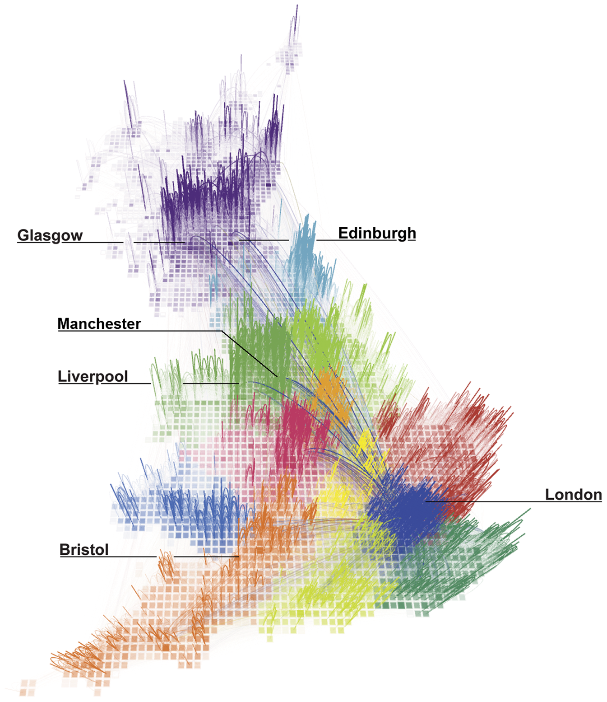
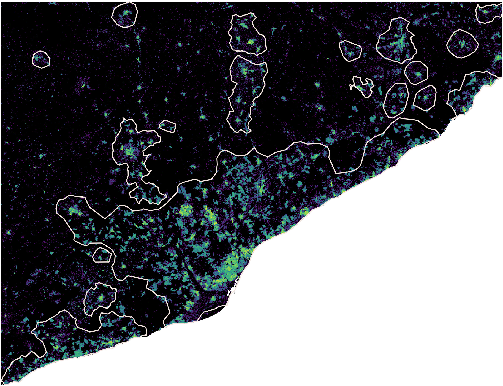
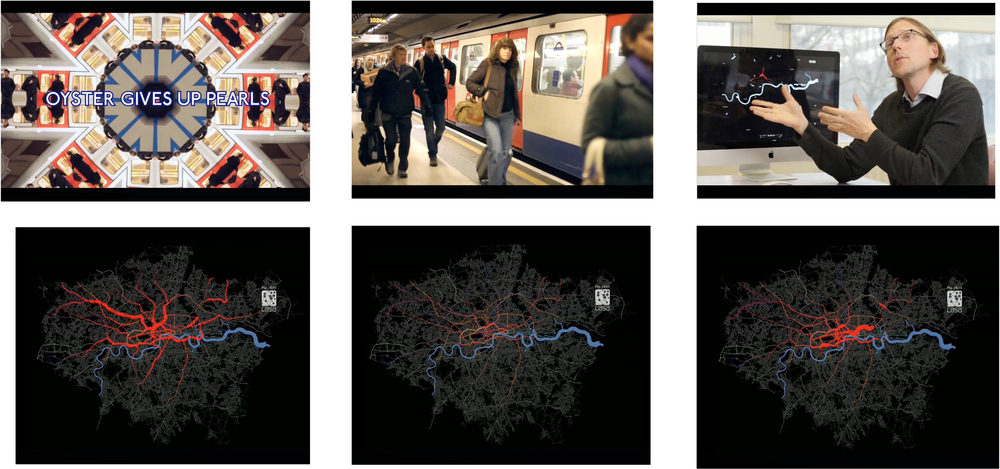
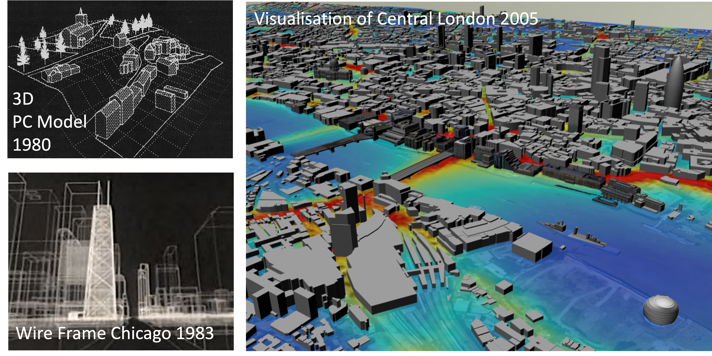
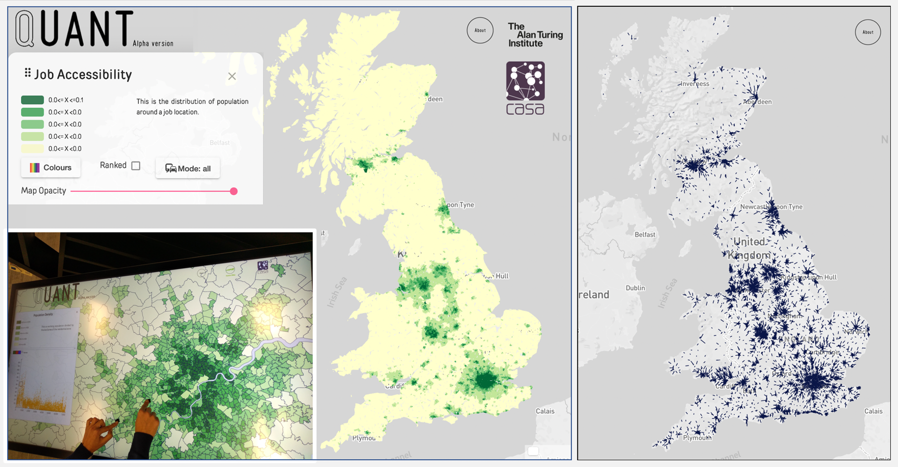

# All of this may seem very new and very scary if you have a 'traditional' background in Planning, Geography, or Urban Studies but... 

::: {.notes}

... we actually have a long history of cutting-edge computer use in these disciplines! Every time there has been a step-change in computing, geography and planning have been there to exploit it!

:::

# A Bit of History

## Two Windows {auto-animate=true}

::: {style="padding-top:60px;font-size:40pt;"}

**1997** — anyone with a brain and a pulse could get a job building websites.

:::

::: {.notes}

The decisive moment in my own biography was not a degree. It was moving to New York in the late nineties, when there was a window open through which people with, frankly, half a brain and a pulse could walk into a job at a dot.com start-up.

I had no qualifications whatsoever. I took something I had been messing about with at university and somehow convinced them that I could do a job. Everything downstream -- the PhD, the Oyster card data, all of it -- depended on that opportunity.

That window closed a long time ago, but the moral is not "well, you should have been born earlier".

:::

## Two Windows {auto-animate=true}

::: {style="padding-top:60px;font-size:40pt;"}

**1997** — anyone with a brain and a pulse could get a job building websites.

**2026** — everyone wants "graduates with AI skills" and almost no one can say what that means.

:::

::: {.notes}

I think there is another window open now.

Every employer and institution currently says it wants people with AI skills. Ask them what they mean and they might get as far as: prompt engineering or fine-tuning LLMs. I suspect that both of those fields will be obsolete by the time you graduate.

Nobody knows yet what 'AI skills' are. Yet. That means it is still being decided. And the people who will decide it are those who can say something about what these systems can and can't do.

My claim is that the hard thing is the ability to work out what a model has thrown away. That is a fundamentally critical
 skill before it is a technical one, and it depends on knowing your domain. Your place.

**That's the geography terminology: a *place* has a history and is, consequently, contingent.** Windows open somewhere, f
or someone, at a particular moment. Knowing where you are standing -- what you can see from here that others can't -- is
the skill.

:::

## 3 Waves

:::: {style="padding-top:60px;font-size:40pt;"}

::: {.incremental}
1. A computer in every **institution**
2. A computer in every **office**
3. A computer in every **thing**
:::

::::

::: {.aside}

See: @ArribasBel2018.

:::

::: {.notes}

Now for some history. Without wanting to get all technologically detemrinist about it, the relationship between computing and academia is clearly contingent. Geographers actually quite like computers and so this relationship is particularly clear in our discipline; my colleague Dani and I argued for three waves, roughly.

**Wave 1, 1950s-70s.** The computer as a super-human calculator. Data and models as a way of testing theory. Retrospectively called the first quantitative revolution, though I think that framing undersells how much of it was theoretical rather than computational.

**Wave 2, 1980s-2000s.** Computers as tools for thinking about spatial *relationships*. Explicit modelling of local effects such as Geographically Weighted Regression and Getis-Ord clustering. Retrospectively called the GIS revolution, but I think GIS is squarely Wave 1 and the term 'geocomputation' points to the literature that was more relevant here. GIS was the industrialisation of cartography but it didn't change what we were thinking.

**Wave 3, mid-2000s onwards.** Computation spreads into every object, and those objects generate data continuously as a byproduct of doing something else. We could call this the 'big data' revolution but I think it's something different from that because it has allowed us to make a transition from studying attributes to studying behaviours.

:::

## All Waves Are Still Running

::: {style="padding-top:60px;font-size:40pt;"}

- Wave 1: computers help me go **faster**
- Wave 2: computers help me **think**
- Wave 3: computers help me **learn**

:::

::: {.notes}

**These are not eras**. They are three different relationships with machines, and all three are running in parallel, in
this building, in this week.

Wave 1 is most of what we still do: the same analysis, but faster and bigger. Wave 2 is when the machine changes how you
 think: making use of recursion, iteration, local statistics. In principle these were available in Wave 1, but in practi
ce nobody was doing them because the costs of doing so on a punch card were too high. Wave 3 is letting the machine indu
ce structure we didn't specify. Also available in principle in Wave 2, but again not what people were doing.

The 'era framing' is what produces the **a-historicity.** If you believe you're in the AI era, then the quantitative-rev
olution era is over, and its arguments are settled, and you don't need to read them. Whereas if all three are live, then
 a 1972 objection to Wave 1 might *still* be an objection to what you did last Tuesday.

:::

## Wave 1

{height="540"}

::: {.aside}

[@ratti2010redrawing]{.attribution}

:::

::: {.notes}

Here is Wave 1. Billions of phone calls. 25 years ago this was a supercomputing problem; 15 years ago I ran it over 2 days on a Mac tower; now it's an afternoon on a laptop.

This work used *network science* to divide the UK into regions by finding the edges of its calling networks. But we were using the same approaches, the same measures, and the same intellectual apparatus as @granovetter1983strength in 1983. What changed was the price. That is precisely the Wave 1 relationship: the computer helping me do faster what I already knew how to do. Not that there is nothing wrong with that. Most valuable work is like this.

But let me ask you something...

:::

## Over to You!

::: {style="padding-top:200px;font-size:40pt;"}

**Q.** Where does **London** end?

:::

::: {.notes}

**[P1b — sixty seconds. Not pairs, just shout it out. Do not let this run long: the disagreement is the finding, not the answer.]**

You all walked here this morning. So: where does Termoli stop being Termoli?

Take three or four answers.

Possible answers: the built-up area; the *comune* boundary; where the bus route ends; where people stop commuting in; where it stops *feeling* like the town. **They will disagree with each other, and every one of them will be defensible.**

This should not be a hard question. Some of you grew up near here but we cannot agree on the answer. Now notice that **e very model of a city starts by answering this question but silently**, usually by inheriting whatever boundary came with the data.

So before a model throws anything else away, **it throws away the edge.** Not what's past the boundary but *the fact of a boundary at all*. That is the first discard, it is made before any of the interesting choices, and it is almost never a conscious choice by the modeller.

Hold that thought. 

:::

## Wave 2

{height="540"}

::: {.aside}

Source: @arribas2021building

:::

::: {.notes}

So here is a very clever way to try to answer this question and it's rooted in an understanding of both computation *and* geography. The paper adapts DBSCAN to the problem of defining cities in Spain. But to run DBSCAN against a data set containing data on every single building in Spain we'd still need a supercomputer.

And for each realisation of the clustering all I'd get is a hard answer: core (i.e. clustered) and noise (i.e. unclustered). By implication, we could walk a boundary of each city-cluster: the building on the right? part of the city. the building on the left? an outlier.

What A (Approximate)-DBSCAN does is to sample the data and perform multiple clusterings using different subsamples. On each pass, the observations not included in that subsample are then assigned the value of the closest observation included in the run. Over multiple runs what do we gain? Confidence!

And we get it for free: observations that are always clustered are unquestionably part of the city; observations that are never clustered are unquestionably rural; those that are *sometimes* clusters are part of a transition zone. And we can cut that transition zone differently using the confidence interval derived from the number of times an observation was clustered vs non-clustered.

This is using the algorithm as a tool for thinking geographically. It actually makes a virtue of small compute resource to achieve something that a classic 'big data' approach would not: it respects uncertainty and builds confidence, and it reflects what we know about cities in that they don't have hard edges.

**And that is why this is Wave 2 and not Wave 1.** A faster computer gives you the same hard boundary, just sooner. This gives you a different *kind* of answer — one that matches the shape of the thing we're studying. The room could not agree where Termoli ends because there is no line there to find, so why not work with that? Doing so takes a change in how we think rather than a change in how fast we compute.

:::

## Wave 3

::: {.aside}

See: [Pulse of the City](https://vimeo.com/41760845).

:::

::: {.notes}

My own first-hand encounter with Wave 3, and the reason I'm here.

Oyster card data. London's transport smartcard. Every tap, every day, for millions of journeys — generated not for research but as a byproduct of collecting fares. Nobody designed it to tell us anything about the city. It just fell out of the ticketing system.

This is the canonical Wave 3 object: data as exhaust. And the shift it enables is exactly the one Hägerstrand wanted — **from studying attributes to studying behaviours.** The census tells me what kind of person lives in a place. This tells me what people actually did on Tuesday.

I got access through a relationship I could only build because of the commercial years, which is the "place" argument again: I was standing somewhere that made a particular thing visible and available.

:::

## This isn't new

> I think that the computer can do three different and useful things for us. The first and simplest operation is... **descriptive mapping** the second... is the **analytical one**. The third kind of service is... to run **process models** by which we might try to reproduce observed or create hypothetical chains of events of a geographical nature. 
>
> @hagerstrand:1967

::: {.notes}

Descriptive mapping? Wave 1. The analytical stage? Wave 2. Process models that reproduce or generate chains of events? That is Wave 3, and today we might try to hoover up all of that data into a digital twin, but Hagerstrand anticipated it sixty years ago!

By failing to read much of anything published more than five years ago, let alone a book published fifty years ago, we're missing out on a *lot*. Just because we have better tools (or toys), doesn't mean we're better thinkers.

So as GeoAI and geographic foundation models arrive, I see both real transformative potential *and* a genuine failure to learn from history. It seems that we are the first people to think about cities, about data, and about analytics. We are not and, worse, we have some persistent blind spots when we start hopping between disciplines.

:::

## Forty Years Later

> We predict that **the pace of social life in the city increases with population size**, in quantitative agreement with data, and we discuss how cities are similar to, and differ from, biological organisms, for which $\beta < 1$. Finally, we explore possible consequences of these scaling relations by **deriving growth equations, which quantify the dramatic difference between growth fueled by innovation versus that driven by economies of scale**.
>
> [@bettencourt:2007]{.attribution}

::: {.notes}

Forty years after Hägerstrand, and we have this very clever and very highly-cited paper. To summarise: social quantities — crime, patents, wages — grow *faster* than population; infrastructure grows *slower*. One exponent, around 1.15, claimed to hold across cities and across nations.

It is elegant, it is testable, and it launched a whole field of people looking for scaling laws in cities and regions. Note the register though — *we predict*, *in quantitative agreement with data*, *deriving growth equations*. That is physics arriving in the city and finding it tractable.

And I note too that several of these authors previously offered their insights on scaling to biologists. But let me ask you something first.

:::

## No really, it isn't new

> More important, there is a clear disparity between the sophisticated theoretical and methodological framework which we are using and our ability to say anything really meaningful about events as they unfold around us. There are too many anomalies between what we purport to explain and manipulate and what actually happens. There is an ecological problem, an urban problem, an international trade problem, and yet we seem incapable of saying anything of any depth or profundity about any of them. When we do say something it appears trite and rather ludicrous.
>
> @harvey:1972 [p. 17]

::: {.aside}

See also: *Do Physicists Have Geography Envy? And What Can Geographers Learn from It?* [@OSullivan2015]

:::

::: {.notes}

Like Harvey back in 1972 I'm not saying that these kinds of methods are useless, I'm suggesting that they work beautifully but don't really produce something that anyone needs. **Sophisticated apparatus, trivial output.** My quibble with this work isn't new, it was made 50 years ago but *did not travel*. Nobody suppressed it. Different journals, different vo
cabularies, different ideas about what counts as an explanation.

**That is flows, the second of my four words.** Information does not cross a disciplinary boundary by itself. **The ability to breach that boundary is where I think value lies**: whoever can carry a result across is doing something neither side can do alone, and both sides undervalue them right up until they don't. Every one of you is standing at somebody el
se's boundary this week.

The newcomers aren't stupid; they're walking into a field with fifty years of hard-won negative results that nobody is reading.

:::

# The twin

::: {.notes}

OK, so remember that @hagerstrand:1967 said the computer could help to develope *process models by which we might reproduce observed or create hypothetical chains of events*. That third thing has a name now. We call it a digital twin.

:::

## Digital Twins

::: {.notes}

What's a digital twin? In most cases the simplest answer is 'the buzz word of the day', but ask 10 academics and get 10 different answers. At it's most basic we're talking about a virtual representation of a physical object. The term seems to trace back at *least* as far as @gelernter:1993's *Mirror World, or the Day Software Puts the Universe in a Shoebox...*.

In a built environment context, it seems we could even trace it back to the 1980s: top is a model of an English village, and below that is an output from a SOM Architects-generated model for 9 US cities. These were attempts to understand the relationship between different forms and masses in the real world. On the right is an early attempt to superimpose other contextual information -- pollution in this case on to a 3D surface.

But you have *already* heard (indirectly) about these in other disciplines in the modelling of complex biological systems and a models asked to predict where a drug might be found. Build a faithful representation, then ask it what happens next. So although I'm going to talk about cities, this is not *just* about cities.

:::

## The Ambition

::: {.notes}

This is where the ambition currently sits in my field, and it is genuinely impressive.

Exascale and distributed computing let us model interactions between places at a scale that was impossible ten years ago. More than that, we can start to model **second- and third-order effects** — the knock-ons. Close a station and people don't just stop using that station; they redistribute, and *that* redistribution changes something else. Those effects are everywhere in cities and they add exponentially to the computational cost, which is why they were routinely assumed away.

And the natural next step, which people are actively pursuing: **models inside other models.** The output of one becomes the input to another; the same model runs at several scales at once. For some domains that composes cleanly, but for cities -- each with its own history of technology, policy, politics and data -- it does not, and I think we underestimate how badly it doesn't.

:::

## Models and Abstractions

:::: {style="padding:100px"}

> In this sense, theories abstract from an agreed reality **throwing away that which appears irrelevant** to the purpose in hand and only **keeping what appears to be essential** to good explanation. 
> 
> @batty2016theoretical

::::

::: {.notes}

Models can represent the **actual** system, or they can be a **conceptual** or **mathematical** version of the system. However, it's fairly uncontroversial to acknowledge that they are a **simplification** of the real thing where choices are made to further the function of the model. 

Obviously, as our access to 'compute' has expanded so has our ambition for the **scale of system** to be monitored and controlled, but the fundamental limitation remains: our understanding of function will vary from person to person, or group to group, so it's highly likely that, even if we're trying to build **the same model** we'll end up with something different. 

:::

---

::: {style="padding-top:200px;font-size:40pt;"}
|                 |   |                |
| :------------ | - | :----------- |
| Urban Analytics |   | High Frequency |
| Urban Theory^[Or politics!] |   | Low Frequency |
::: 

::: {.notes}

That Wave 3 I was talking about also presents us with a conceptual challenge linked to frequency. For **high frequency** models, you can think of 'smart' systems, whether they are the 'smart trees' at the 2025 Chelsea Garden Show or the 'smart cities' that have been a developmental priority in many countries. For most models and twins it's relatively straightforward to peer a short way into the future.

That's why, in the high-frequency world of urban analytics it seems plausible that **we can use the twin to *influence* the real thing**. **Real-time data** about the Tube system doesn't just mirror what's happening in the Tube, it can be used to **shape and change** the deployment of people and infrastructures.  

But when we try to use high frequency data to forecast **what cities might look like in ten, twenty, or thirty years** we run into huge issues. I literally cannot even get long-duration data for cities, let alone control for the effects of policies, politics, or 'random' effects such as the Global Financial Crisis. 

So there is a real danger in attempting to use high-frequency data or urban analytics techniques on low-frequency problems. A big part of that is the absence of guardrails when you don't begin with any kind of **theory** about the system you are modelling. 

:::

---

::: {style="padding-top:200px;font-size:40pt;"}
|                 |   |                |
| :-------------- | - | :------------- |
| Shallow copy    |   | Copy by reference |
| Deep copy       |   | Copy by value |
::: 

::: {.notes}

There's a nice analogy here to how programmers talk about shallow and deep copies of objects and data structures. They mean this in a very particular way about **copying references** (pointers to the real data) and **copying values** (the data itself). 

Copying by reference is fast and efficient, but changes to the reference update the original. Copying by value replicates the object itself in a new memory space where changes to the copy don't affect the original. So that's slower, less efficient, but can also be safer. When you copy by value on large data sets you often have to think rather carefully about what data you actually *need*.

So at the risk of stretching this analogy to breaking point, all of this throws up a deeper meaning as well: perhaps our digital twins **copy normative values as well**? In building a digital twin we make choices about scope: what to keep and what to throw away and those decisions are *not* neutral even though all of our training as scientists tries to suggest that they are.

:::

## Why a Human in the Loop

> The idea that there can only be one twin is now pass&eacute; for it is increasingly clear that as models are simplifications of the real thing, there can be many different **variants mirroring different features of the real system that embody different theoretical perspectives**.
>
> @batty2023twins

::: {.notes}

So we need to look closely at what we model and, in the case of cities, acknowledge the essential incompleteness of any kind of deep copy. So rather than thinking about 'the one true twin', there's another approach in which we aim for a multitude of perspectives that are rooted in the slow cycles of theory. They are hierarchical and contradictory, overlapping and multi-scalar, but this highlights the importance of human judgement and the need to think about what is 'copied' into the twin and how its outputs are copied back into the real world...

Without the human-in-the-loop, AI-optimises-everything leaves a system that is higly optimised for some unspoken criterion, but almost certainly extremely brittle. Efficiency is, paradoxically, an economic problem: the hyper-efficient allocation of 'resources' does not lead to the kinds of innovation that arise in places where 'friction' and 'redundancy' and 'collision' create new pathways for development. And my point is that conceptualising the value of the human in all of this is absolutely critical: without that feedback loop it's highly likely we end up with cities that boring, fragile, and deeply unpleasant to live in.

:::

## 

::: {style="padding-top:200px;font-size:48pt;text-align:center;"}

There is no **shallow copy** of a city.

:::

::: {.notes}

So a shallow copy of the city would be one that points back at the real thing — cheap, fast, always current, and requiring no decisions from anybody. There isn't one. **Every twin is a deep but incomplete copy**, which means somebody chose what to bring across and what to leave behind. There is no version of this where the copying happens by itself.

So a twin is not a mirror. **It is an argument about what a city is, rendered in software and then run at scale.** And like any argument it can be interrogated: you can ask what it assumes, whose interests it serves, and what it had to discard in order to be computable at all.

A twin is an attempt to make a *place* computable. But a place is constituted by its history — the path it took to get here, which is why I opened with path dependency. A twin has no history, it has **state**: everything it knows about a place is about what that place is like right now. That's not a limitation of current hardware, it's what a model *is*.

:::

# Error is a Political Decision

## Additional Resources {.smaller}

- [The Data of Urban Spaces](https://towardsdatascience.com/may-edition-the-data-of-urban-spaces-815831aaf749) — a nice collection of pieces on [Towards Data Science](https://towardsdatascience.medium.com)

# Thank You {background-image="/img/web/title-slide.png" background-color="#f7eff5" background-opacity="0.2"}

<h3>References</h3>
