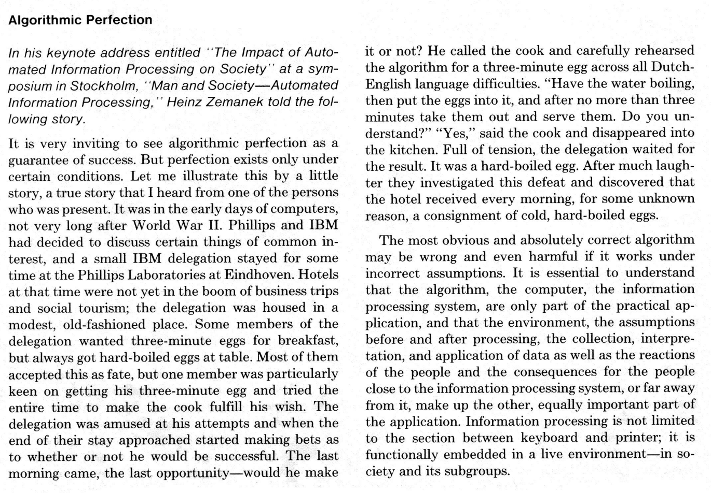

## Overview

::: {.callout-important}
This week's learning objectives are:

1. Get caught up on any missed reading(s).
2. Start a literature 'scan' to identify readings that will support the [group assessment](../assessments/group.qmd); I'd give a particular focus to critical takes (because they're harder to grasp but useful for deepening your thinking) and those documenting or modelling the impact of Airbnb.
3. Go back over the first five notebooks in order to self-test and check your understanding. This doesn't mean re-doing the full notebook, just looking at the harder parts and seeing if you can do them without as much assistance/guidance.
4. Identify what makes a briefing effective for a non-specialist audience by reading the [example briefings](#example-briefings) below.

:::

::: {.callout-tip}
### Getting Ahead of the Assessment

Do as many (relevant) assessment-related readings as you can this week: it's the only time you don't *also* have to work on the code, so developing a clear sense of where you want to go *now* will be really helpful for reducing workload later!

:::

So I'd strongly suggest that you browse the [Full Reference List](../references.qmd) for ideas. The bibliography is a working document and I will add more items as and when I come across them, or new works are published, but this is a good time to start reading about the ethical and practical issues arising from Airbnb's operations and the data to which we have access.

## Example Briefings

Your group's submission is a *briefing*, not an essay (see the [Briefing](../assessments/content.qmd) guidance), and Reading Week is a good time to look at how others write for an intelligent but non-specialist reader. As you read, notice how each one puts the key findings first, explains its data and methods in a sentence or two, and uses charts that each make a single point.

A bit on the short side, but useful for thinking about how to stick to the key points:

- Rae, A. (2017), *Analysis of Short-Term Lets Data for Edinburgh*, a nine-page briefing note; [PDF](https://greens.scot/sites/default/files/public/AnalysisShortTermLetsDataforEdinburgh_AlasdairRae_PDF-FINAL_1.pdf).
- UK Parliament's [POSTnotes](https://post.parliament.uk/type/postnote/): four-page research briefings for MPs and Peers on science and social science topics.

Longer, but worth skimming for ideas about structure and presentation:

- Evans, A. *et al.* (2019), *Research into the impact of short-term lets on communities across Scotland*, Scottish Government; [URL](https://www.gov.scot/publications/research-impact-short-term-lets-communities-scotland/).
- House of Commons Library, *The growth in short-term lettings in England* (CBP-8395): a long policy briefing, useful as background on regulation (including London's 90-night limit) rather than as a model of length; [URL](https://commonslibrary.parliament.uk/research-briefings/cbp-8395/).
- The three reports listed in the [Briefing examples](../assessments/content.qmd#examples) (Centre for London, the Economic Policy Institute, and McGill University).

For ideas about *how* to write one (without prescribing this *exact* format!):

- IDRC, [How to write a policy brief](https://idrc-crdi.ca/en/funding/resources-idrc-grantees/how-write-policy-brief).
- University of Birmingham, [How to write a policy brief](https://www.birmingham.ac.uk/about/college-of-social-sciences/policy-engagement/how-to-write-a-policy-brief).

## Readings

We've deliberately refrained from more academic readings this week, so the following content was selected to be easily-digested and interesting in terms of the practical limitations of 'AI' tools and the ways in which they reproduce errors in our own thinking rather that offering neutral, 'objective' insight:

- [AI translation jeopardises Afghan asylum claims](https://restofworld.org/2023/ai-translation-errors-afghan-refugees-asylum/)
- [An Iowa school district is using ChatGPT to decide which books to ban](https://arstechnica.com/information-technology/2023/08/an-iowa-school-district-is-using-chatgpt-to-decide-which-books-to-ban/)
- [Singapore's tech-utopia dream is turning into a surveillance state nightmare](https://restofworld.org/2021/singapores-tech-utopia-dream-is-turning-into-a-surveillance-state-nightmare/)

And here's a nice example of why it's *not* about the algorithm:

{fig-alt="Screenshot of an IEEE piece from the 1980s that I'm unable to access any other way" width="90%"}

Source: @zemanek1983

### How I'm fighting bias in algorithms

```{=html}
<div style="max-width:854px">
    <div style="position:relative;height:0;padding-bottom:56.25%">
        <iframe title="How I'm fighting bias in algorithms" src="https://embed.ted.com/talks/lang/en/joy_buolamwini_how_i_m_fighting_bias_in_algorithms" width="700" height="480" style="position:absolute;left:0;top:0;width:100%;height:100%" frameborder="0" scrolling="no" allowfullscreen></iframe>
    </div>
</div>
```

### Ethics, Politics & Data-driven Research and Technology


